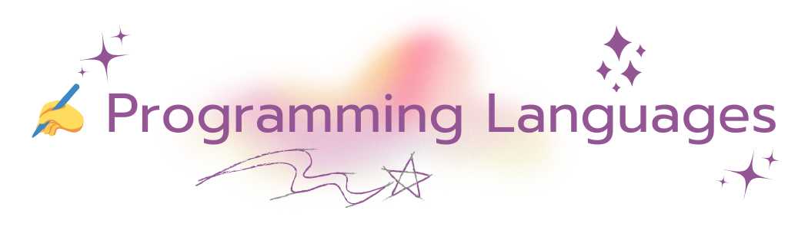
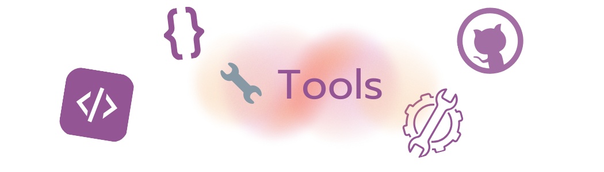

## Hi there 👋
I'm a student at <a href="https://shh.ocsb.ca">Sacred Heart High School</a>!
I'm interested in coding and video games, but I'm not really good at the former.

  
  
  
  

  
  
  

  
  
